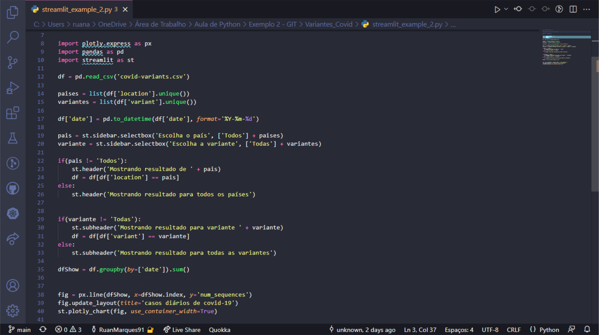
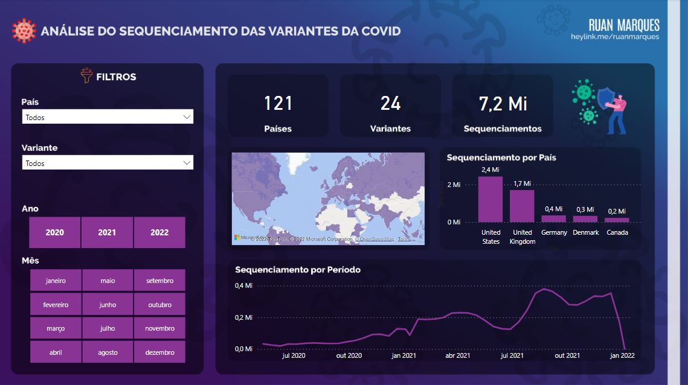

# VARIANTES DA COVID: Aplicação em Python + Dashboard Power BI.

Esta é uma pequena aplicação em Python, utilizando a biblioteca pandas onde o foco é a análise de dados do sequenciamento das variantes da covid no mundo.

Para exibição foi utilizado o Streamlit que é um framework de código aberto criado para ajudar Cientistas de Dados a publicar projetos sem a necessidade de grande conhecimento de ferramentas de front-end ou de deploy de aplicações.

<b>Streamlit</b>

<b>Código em Python</b>

  
Como BÔNUS, também resolvi desenvolver um dashboard no Power BI com a Base de Dados.

<b>Power BI</b>

  
OBS: Arquivo em BI disponível para download!

<b>Link da Aplicação no Streamlit:</b> https://share.streamlit.io/ruanmarques91/variantes_covid/main/streamlit_example_2.py

<b>Link da Base de Dados utilizada:</b> https://www.kaggle.com/yamqwe/omicron-covid19-variant-daily-cases

 
https://heylink.me/ruanmarques